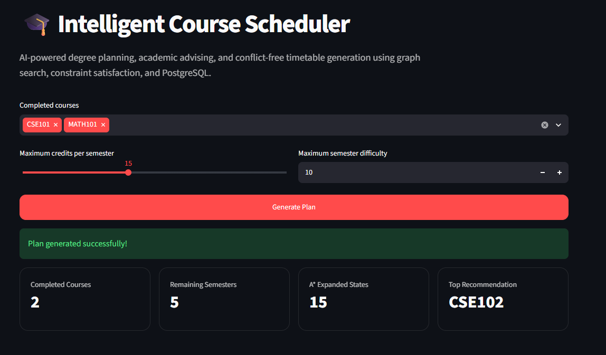
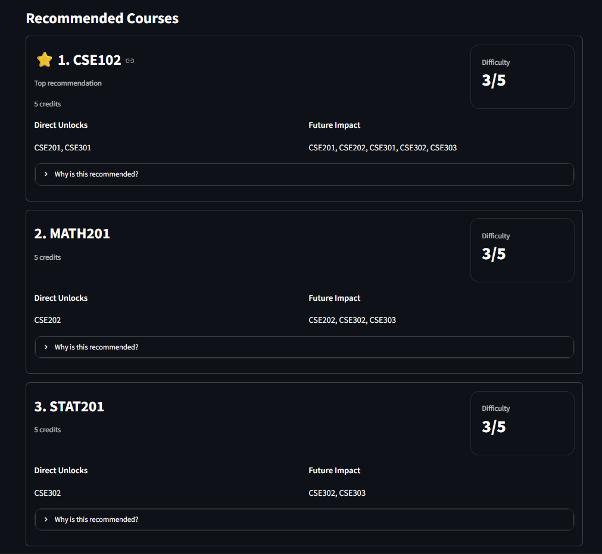
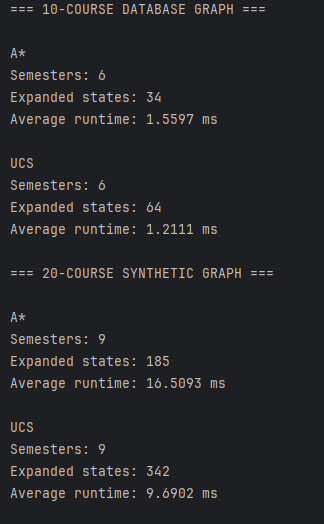
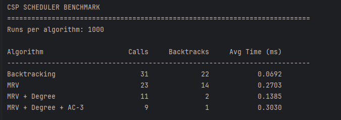
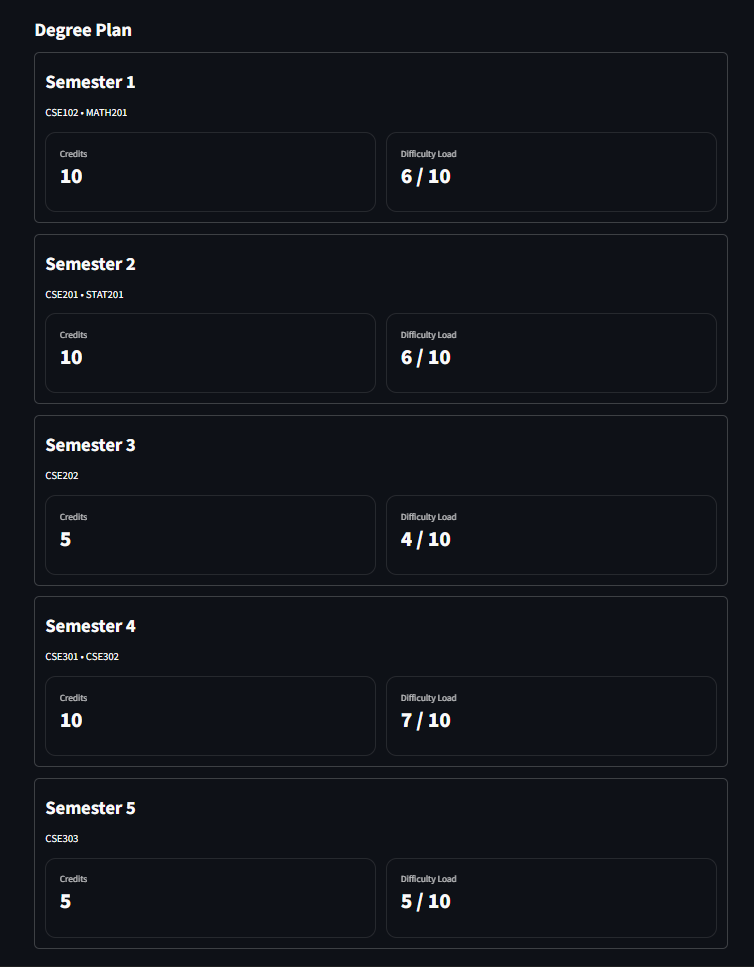
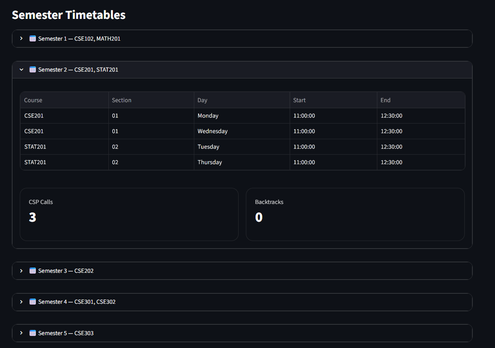

# 🎓 Intelligent Course Scheduler

After I completed CS50 Python and CS50 Ai, I decided to build a project where I can use everything
I learned while building it, and also developing some other skills like PostgreSQL, FastAPI, Streamlit and Panda.


An AI-based course planning system that helps students decide **what to take next**, build a degree plan, and generate **conflict-free timetables**.

I built this project to combine topics I learned in AI, algorithms, databases, and backend development into one complete application.

---

## 🚀 What It Does

- 🧠 Plans future semesters using **A\* Search**
- ⭐ Recommends useful courses to take next
- 🔒 Explains why courses are blocked
- 📅 Generates conflict-free semester timetables
- ⚙️ Respects credit and difficulty limits
- 📊 Shows search and CSP statistics
- 🌐 Connects everything through FastAPI and Streamlit

---

## 🖥️ Demo

The user selects completed courses and semester limits.

The system then generates:

```text
Academic Advice
      ↓
Degree Plan
      ↓
Conflict-Free Timetables
```

<!-- Replace with your screenshot -->



---

## 🧠 How It Works

The project mainly uses two AI approaches.

### A* Degree Planner

A* decides **which courses should be taken in each semester**.

It considers:

- prerequisites
- maximum credits
- semester difficulty
- remaining prerequisite chains

The heuristic combines:

```text
remaining-credit lower bound
+
longest unfinished prerequisite chain
```

The stronger estimate is used to guide the search.

### CSP Timetable Scheduler

After the courses are selected, the CSP solver decides **which section of each course can fit without time conflicts**.

I implemented:

```text
Backtracking
MRV
Degree Heuristic
AC-3
```

The final solver combines:

```text
MRV + Degree Heuristic + AC-3 + Backtracking
```

---

## 🤖 Academic Advisor

The advisor analyzes the student's current progress and shows:

```text
✅ Completed Courses
🔓 Eligible Courses
⭐ Recommended Courses
🔒 Blocked Courses
```

Recommendations are ranked based on how much a course helps unlock future courses.

<!-- Replace with your screenshot -->



---

## 📊 Benchmarks

I benchmarked the algorithms instead of only checking whether they found a solution.

### Improved A* Heuristic

| Heuristic | Expanded States | Avg. Time |
|---|---:|---:|
| Old Heuristic | 61 | 0.9040 ms |
| Improved Heuristic | **33** | **0.6651 ms** |

The improved heuristic reduced expanded states by about **46%** and was also faster in this test.

---

### A* vs Uniform Cost Search

1000 runs per algorithm.

| Dataset | Algorithm | Semesters | Expanded States | Avg. Time |
|---|---|---:|---:|---:|
| 10 courses | A* | 6 | **34** | 1.5597 ms |
| 10 courses | UCS | 6 | 64 | **1.2111 ms** |
| 20 courses | A* | 9 | **185** | 16.5093 ms |
| 20 courses | UCS | 9 | 342 | **9.6902 ms** |

A* expanded about **47% fewer states** on the 10-course graph and about **46% fewer states** on the 20-course graph.

However, UCS was faster in raw execution time on these relatively small search spaces because A* also spends time calculating the heuristic.

This was useful to see because reducing the number of expanded states does not always mean lower runtime.



---

### CSP Scheduler Benchmark

1000 runs per algorithm.

| Algorithm | Calls | Backtracks |     Avg. Time |
|---|---:|-----------:|--------------:|
| Backtracking | 31 |         22 | **0.0692 ms** |
| MRV | 23 |         14 |     0.2703 ms |
| MRV + Degree | 11 |          2 |     0.1385 ms |
| MRV + Degree + AC-3 | **9** |      **1** |     0.3030 ms |

Compared with plain backtracking, the final solver used about:

- **71% fewer recursive calls**
- **95% fewer backtracks**

The Degree heuristic also helped when MRV had ties, reducing calls from **23 to 11**.

The more advanced solver is not the fastest on this small benchmark because MRV and AC-3 add overhead, but they reduce the amount of search significantly.

<!-- Replace with your benchmark screenshot -->



---

## 📅 Degree Plan & Timetables

The final result contains a semester-by-semester degree plan and a conflict-free timetable for every planned semester.

<!-- Replace with your screenshots -->





---

## 🛠️ Tech Stack

**Python · PostgreSQL · FastAPI · Streamlit · Pandas · Pytest**

AI / algorithms used:

```text
A* Search
Uniform Cost Search
Graph Search
DFS
Topological Sort
CSP
Backtracking
MRV
Degree Heuristic
AC-3
```

---

## 🗂️ Project Structure

```text
intelligent-course-scheduler/
│
├── database/
│   ├── schema.sql
│   ├── seed_data.sql
│   └── queries/
│
├── src/
│   ├── ai/
│   │   ├── advisor.py
│   │   ├── degree_scheduler.py
│   │   ├── graph.py
│   │   ├── pathfinder.py
│   │   ├── planner.py
│   │   └── scheduler.py
│   │
│   ├── api/
│   │   └── main.py
│   │
│   ├── ui/
│   │   └── app.py
│   │
│   ├── db.py
│   ├── run_advisor.py
│   └── run_degree_scheduler.py
│
├── tests/
├── benchmarks/
├── requirements.txt
├── pytest.ini
└── README.md
```

---

## ▶️ Run the Project

Clone the repository:

```bash
git clone https://github.com/yamenshelbayeh/intelligent-course-scheduler.git
cd intelligent-course-scheduler
```

Create a virtual environment:

```bash
python -m venv .venv
```

Activate it on Windows:

```bash
.venv\Scripts\activate
```

Install the dependencies:

```bash
pip install -r requirements.txt
```

Set up PostgreSQL using:

```text
database/schema.sql
database/seed_data.sql
```

Then configure your local `.env` file with the database connection values.

Start FastAPI:

```bash
python -m uvicorn src.api.main:app --reload
```

Start Streamlit in another terminal:

```bash
python -m streamlit run src/ui/app.py
```

FastAPI docs:

```text
http://127.0.0.1:8000/docs
```

---

## 🧪 Tests

The project currently has:

```text
66 passed ✅
```

Run the full test suite with:

```bash
python -m pytest -v
```

---

## 💡 What I Learned

The biggest thing I learned from this project is that different AI techniques are useful for different parts of the same problem.

**A*** works well for deciding *which courses to take across semesters*, while **CSP** works well for deciding *which course sections can fit together without conflicts*.

I also got more practice with PostgreSQL, APIs, testing, benchmarking, and connecting a backend to a frontend.

---

## 👨‍💻 Author

**Yamen Shelbayeh**

Computer Science Engineering student at the University of Debrecen.

---

⭐ Thanks for checking out the project!
